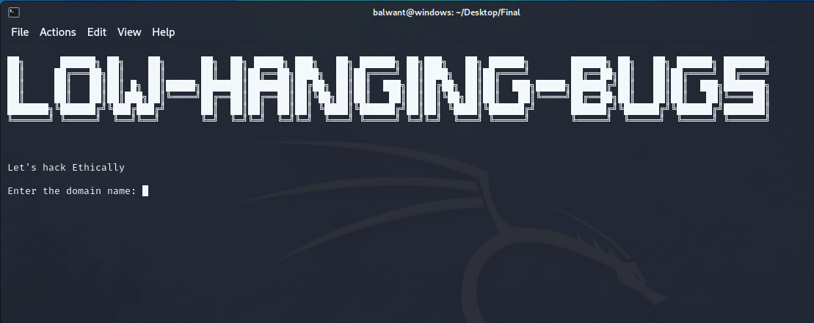
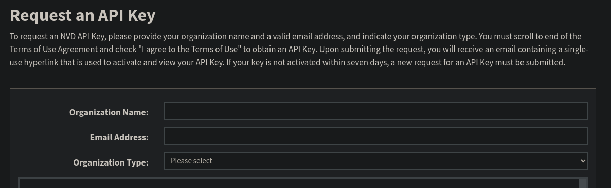

##  Index
* [Project Title and Introduction](#LowHangingBugs)
* [Discover More About the Project ](#More-About-the-Project)
* [Screenshots](#Screenshots)
* [Installation](#Installation)
* [Install Reconnaissance Tool](https://github.com/balwantyadav1/BugHunterKit.git)
* [Installation](#Installation)
* [Report Problem](mailto:yadavbalwant464@gmail.com?subject=Report%20Issue&body=Hello%20Inwep,%0D%0A%0D%0AI%20would%20like%20to%20report%20an%20issue.%20Here%20are%20the%20details:%0D%0A%0D%0A)
* [Contributing](#Contributing)
## More-About-the-Project
[How it Works](Howitworks.md)

# LowHangingBugs


LowHangingBugs is a comprehensive security testing tool designed to identify and assess common vulnerabilities in web applications. Leveraging a range of powerful features, this tool streamlines the process of uncovering potential risks associated with web infrastructure. Below are the key features of **LowHangingBugs**:

1. **Subdomain Discovery:**
   - Quickly identifies subdomains associated with the target domain, providing a comprehensive view of the web ecosystem.

2. **Admin/Login & Registrations Panel Enumeration:**
   - Searches for Admin, Login, and Registration panels within the target domain to pinpoint potential points of unauthorized access.

3. **Clickjacking Vulnerability Check:**
   - Assess the susceptibility of Login & Registration panels to clickjacking attacks, ensuring a thorough evaluation of the web application's security posture.

4. **SPF (Sender Policy Framework) Bug Detection:**
   - Checks for SPF misconfigurations, helping to mitigate email spoofing and phishing risks.

5. **Security Headers Evaluation:**
   - Verifies the presence of essential security headers, such as Content-Security-Policy (CSP), X-Frame-Options, and others, to fortify the web application against common security threats.

6. **Java Library Version Scanning:**
   - Conducts a comprehensive scan of all Java libraries utilized in the target web application, providing insights into potential vulnerabilities associated with library versions.

7. **CVE (Common Vulnerabilities and Exposures) and Exploit Identification:**
   - Automatically searches for known CVEs associated with the web application components and provides information on available exploits, aiding in the prioritization of remediation efforts.

8. **Detailed Reporting:**
   - Generates a detailed report summarizing the findings, vulnerabilities, and recommended actions for enhancing the overall security posture of the web application.

**LowHangingBugs** is your go-to tool for identifying and addressing low-hanging security vulnerabilities efficiently. Elevate your web application security with our comprehensive testing capabilities.


## Screenshots



## Installation


Install LowHangingBugs tool
```bash
git clone https://github.com/balwantyadav1/LowHangingBugs.git

```

```bash
cd LowHangingBugs
```
Get a NVD API key open this link in your browser
```bash
https://nvd.nist.gov/developers/request-an-api-key

```



1. Open the file `js-cve-finder.py` in your preferred text editor or integrated development environment (IDE).

2. Navigate to line 100 within the file.

3. Locate the variable responsible for storing the API key. It may look something like this:

   ```python
   api_key = "your_current_api_key_here"
   ```

4. Replace `"your_current_api_key_here"` with your original API key. Ensure that the new key is accurately entered, without any additional spaces or characters.

5. Save the changes to the `js-cve-finder.py` file. The follow the instruciton

```bash
chmod +x *
```
```bash
pip3 install -r requirements.txt
```
```bash
./run.sh 
```

## License
[MIT License](LICENSE)
## Contributing
[Balwant](https://github.com/balwantyadav1)  - Developer

[Himanshu](https://github.com/Himanshu-sahare)  - Teste
